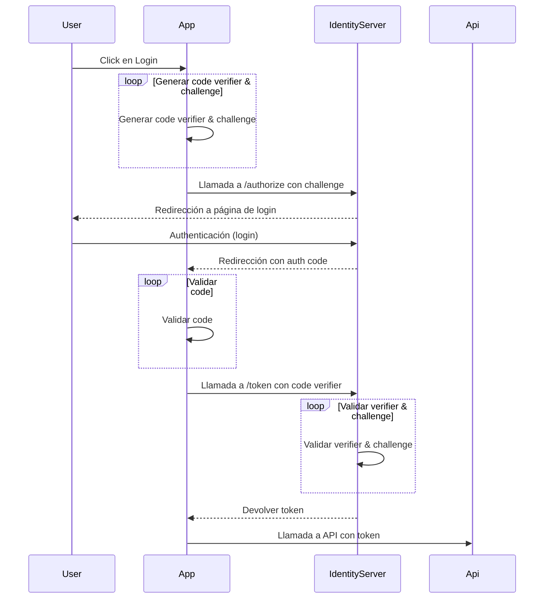

```mermaid
sequenceDiagram
    participant User
    participant App
    participant IdentityServer
    participant Api

    User->>App: Click en Login
    loop Generar code verifier & challenge
        App->>App: Generar code verifier & challenge
    end
    App->>IdentityServer: Llamada a /authorize con challenge
    IdentityServer-->>User: Redirección a página de login
    User->>IdentityServer: Authenticación (login)
    IdentityServer-->>App: Redirección con auth code
    loop Validar code
        App->>App: Validar code
    end
    App->>IdentityServer: Llamada a /token con code verifier
    loop Validar verifier & challenge
        IdentityServer->>IdentityServer: Validar verifier & challenge
    end
    IdentityServer-->>App: Devolver token
    App->>Api: Llamada a API con token
```