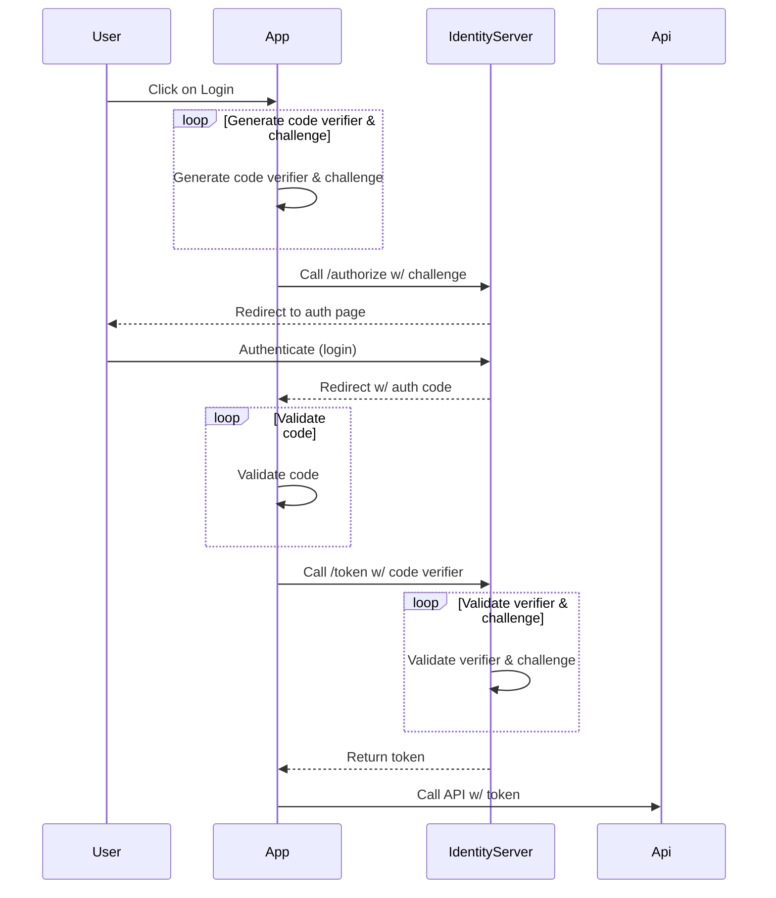

```mermaid
sequenceDiagram
    participant User
    participant App
    participant IdentityServer
    participant Api

    User->>App: Click on Login
    loop Generate code verifier & challenge
        App->>App: Generate code verifier & challenge
    end
    App->>IdentityServer: Call /authorize w/ challenge
    IdentityServer-->>User: Redirect to auth page
    User->>IdentityServer: Authenticate (login)
    IdentityServer-->>App: Redirect w/ auth code
    loop Validate code
        App->>App: Validate code
    end
    App->>IdentityServer: Call /token w/ code verifier
    loop Validate verifier & challenge
        IdentityServer->>IdentityServer: Validate verifier & challenge
    end
    IdentityServer-->>App: Return token
    App->>Api: Call API w/ token
```