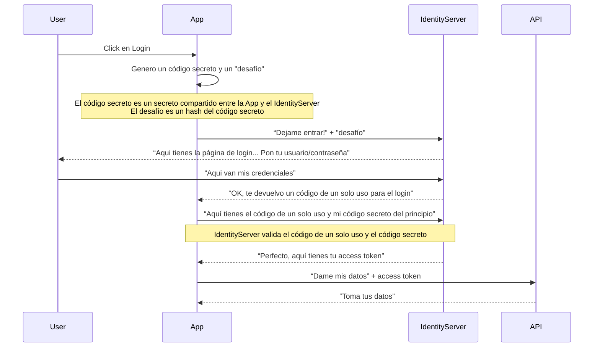

```mermaid
sequenceDiagram
    participant User
    participant App
    participant IdentityServer
    participant API

    User->>App: Click en Login
    App->>App: Genero un código secreto y un "desafío"
    note over App: El código secreto es un secreto compartido entre la App y el IdentityServer<br/>El desafío es un hash del código secreto
    App->>IdentityServer: “Dejame entrar!” + "desafío"
    IdentityServer-->>User: “Aqui tienes la página de login... Pon tu usuario/contraseña”
    User->>IdentityServer: “Aqui van mis credenciales”
    IdentityServer-->>App: “OK, te devuelvo un código de un solo uso para el login”
    App->>IdentityServer: “Aquí tienes el código de un solo uso y mi código secreto del principio”
    note over App, IdentityServer: IdentityServer valida el código de un solo uso y el código secreto
    IdentityServer-->>App: “Perfecto, aquí tienes tu access token”
    App->>API: “Dame mis datos” + access token
    API-->>App: “Toma tus datos”
```