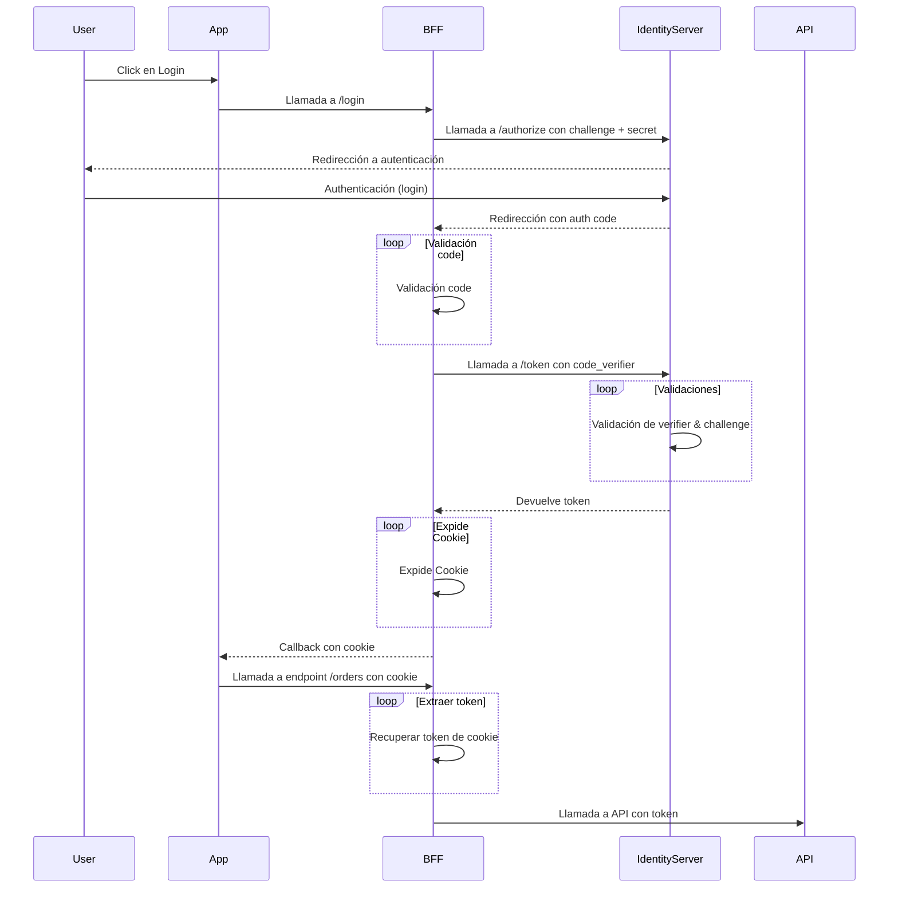

```mermaid
sequenceDiagram
    participant User
    participant App
    participant BFF
    participant IdentityServer
    participant API

    User->>App: Click en Login
    App->>BFF: Llamada a /login
    BFF->>IdentityServer: Llamada a /authorize con challenge + secret
    IdentityServer-->>User: Redirección a autenticación
    User->>IdentityServer: Authenticación (login)
    IdentityServer-->>BFF: Redirección con auth code
    loop Validación code
        BFF->>BFF: Validación code
    end
    BFF->>IdentityServer: Llamada a /token con code_verifier
    loop Validaciones
        IdentityServer->>IdentityServer: Validación de verifier & challenge
    end
    IdentityServer-->>BFF: Devuelve token
    loop Expide Cookie
        BFF->>BFF: Expide Cookie
    end
    BFF-->>App: Callback con cookie
    App->>BFF: Llamada a endpoint /orders con cookie
    loop Extraer token
        BFF->>BFF: Recuperar token de cookie
    end
    BFF->>API: Llamada a API con token
```