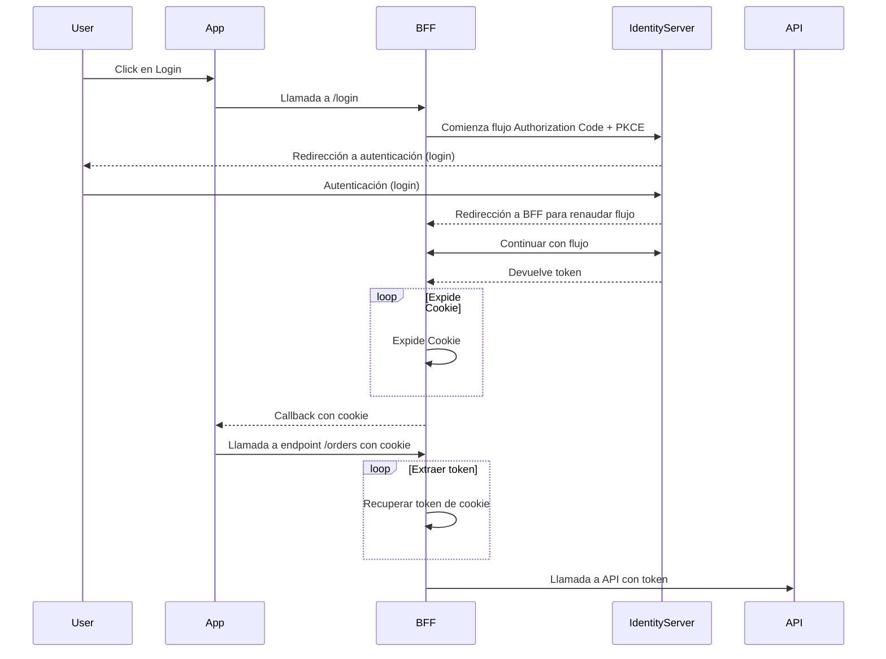

```mermaid
sequenceDiagram
    participant User
    participant App
    participant BFF
    participant IdentityServer
    participant API

    User->>App: Click en Login
    App->>BFF: Llamada a /login
    BFF->>IdentityServer: Comienza flujo Authorization Code + PKCE
    IdentityServer-->>User: Redirección a autenticación (login)
    User->>IdentityServer: Autenticación (login)
    IdentityServer-->>BFF: Redirección a BFF para renaudar flujo
    IdentityServer<<->>BFF: Continuar con flujo
    IdentityServer-->>BFF: Devuelve token
    loop Expide Cookie
        BFF->>BFF: Expide Cookie
    end
    BFF-->>App: Callback con cookie
    App->>BFF: Llamada a endpoint /orders con cookie
    loop Extraer token
        BFF->>BFF: Recuperar token de cookie
    end
    BFF->>API: Llamada a API con token
```