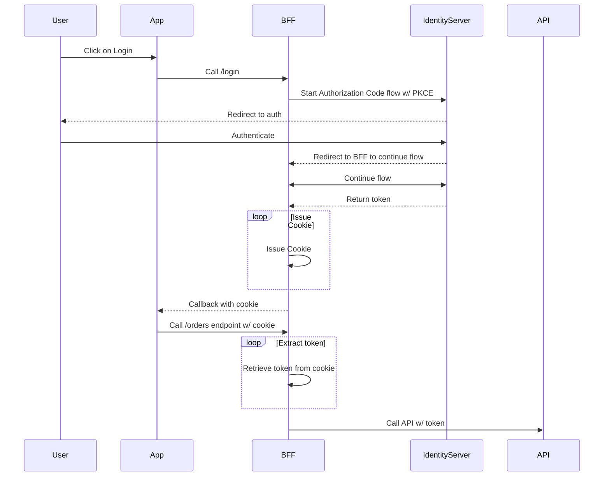

```mermaid
sequenceDiagram
    participant User
    participant App
    participant BFF
    participant IdentityServer
    participant API

    User->>App: Click on Login
    App->>BFF: Call /login
    BFF->>IdentityServer: Start Authorization Code flow w/ PKCE
    IdentityServer-->>User: Redirect to auth
    User->>IdentityServer: Authenticate
    IdentityServer-->>BFF: Redirect to BFF to continue flow
    IdentityServer<<->>BFF: Continue flow 
    IdentityServer-->>BFF: Return token
    loop Issue Cookie
        BFF->>BFF: Issue Cookie
    end
    BFF-->>App: Callback with cookie
    App->>BFF: Call /orders endpoint w/ cookie
    loop Extract token
        BFF->>BFF: Retrieve token from cookie
    end
    BFF->>API: Call API w/ token
```