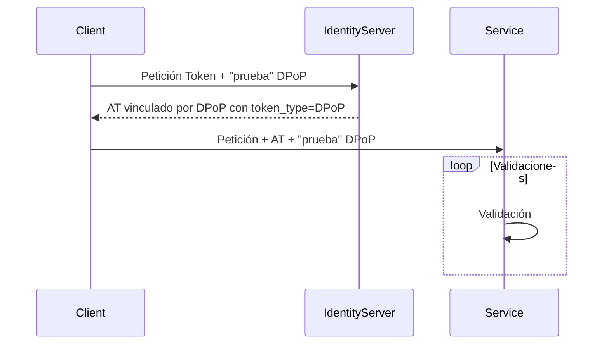

```mermaid
sequenceDiagram
    participant Client
    participant IdentityServer
    participant Service

    Client->>IdentityServer: Petición Token + "prueba" DPoP
    IdentityServer-->>Client: AT vinculado por DPoP con token_type=DPoP
    Client->>Service: Petición + AT + "prueba" DPoP 
    loop Validaciones
        Service->>Service: Validación
    end
```