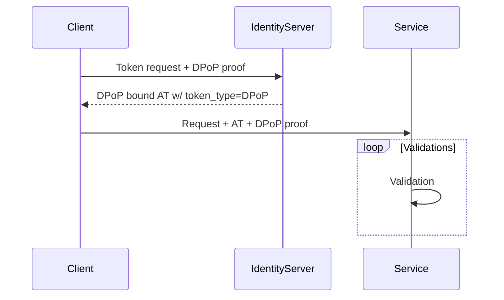

```mermaid
sequenceDiagram
    participant Client
    participant IdentityServer
    participant Service

    Client->>IdentityServer: Token request + DPoP proof
    IdentityServer-->>Client: DPoP bound AT w/ token_type=DPoP
    Client->>Service: Request + AT + DPoP proof
    loop Validations
        Service->>Service: Validation
    end
```